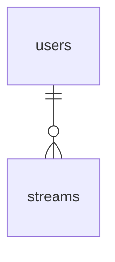

# テーブル設計

postgreSQL 16 を想定。

## ER 図



## テーブル定義

### users テーブル

```sql
CREATE TABLE users (
  user_id UUID PRIMARY KEY DEFAULT gen_random_uuid()
);
```

### streams テーブル

- 長さ制限は API 側で実施するので、配信タイトルと概要欄は`TEXT`型に格納する

```sql
CREATE TABLE streams (
  stream_id UUID PRIMARY KEY DEFAULT gen_random_uuid(),
  user_id UUID NOT NULL,
  FOREIGN KEY (user_id) REFERENCES users(user_id),
  title TEXT NOT NULL DEFAULT '',
  description TEXT NOT NULL DEFAULT '',
  created_at TIMESTAMPTZ NOT NULL DEFAULT CURRENT_TIMESTAMP
);
```

## サンプルデータ

### users テーブルへの挿入

```sql
INSERT INTO users (user_id) VALUES
  ('11111111-1111-1111-1111-111111111111'),
  ('22222222-2222-2222-2222-222222222222'),
  ('33333333-3333-3333-3333-333333333333');
```

### streams テーブルへの挿入

```sql
INSERT INTO streams (stream_id, user_id, title, description, created_at) VALUES
  (
    'aaaaaaaa-aaaa-aaaa-aaaa-aaaaaaaaaaaa',
    '11111111-1111-1111-1111-111111111111',
    'はじめての配信',
    'テスト配信です。よろしくお願いします！',
    '2025-01-01 10:00:00+09'
  ),
  (
    'bbbbbbbb-bbbb-bbbb-bbbb-bbbbbbbbbbbb',
    '11111111-1111-1111-1111-111111111111',
    'ゲーム実況 Part1',
    '人気ゲームをプレイします',
    '2025-01-02 20:00:00+09'
  ),
  (
    'cccccccc-cccc-cccc-cccc-cccccccccccc',
    '22222222-2222-2222-2222-222222222222',
    '料理配信',
    '今日は簡単パスタを作ります',
    '2025-01-03 12:00:00+09'
  );
```
