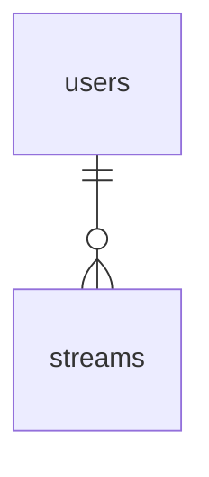

# テーブル設計

postgreSQL 16 を想定。

## ER 図



## テーブル定義

### users テーブル

```sql
CREATE TABLE users (
  user_id UUID PRIMARY KEY DEFAULT gen_random_uuid()
);
```

### streams テーブル

- 長さ制限は API 側で実施するので、配信タイトルと概要欄は`TEXT`型に格納する

```sql
CREATE TABLE streams (
  stream_id UUID PRIMARY KEY DEFAULT gen_random_uuid(),
  user_id UUID NOT NULL,
  FOREIGN KEY (user_id) REFERENCES users(user_id),
  title TEXT NOT NULL DEFAULT '',
  description TEXT NOT NULL DEFAULT '',
  created_at TIMESTAMPTZ NOT NULL DEFAULT CURRENT_TIMESTAMP
);
```
